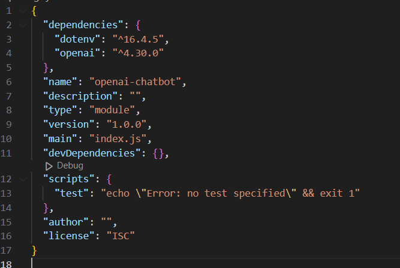
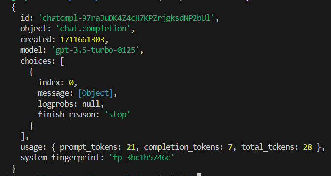
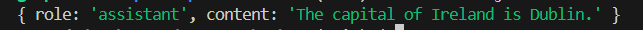
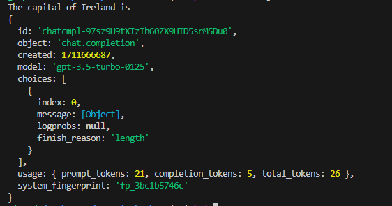
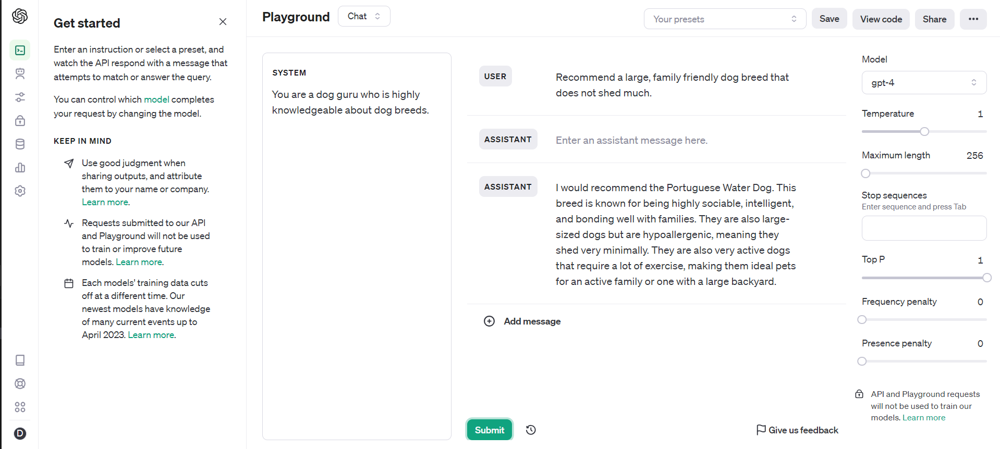

# Mastering the OpenAI API: A Comprehensive Beginner's Guide

Artificial Intelligence (AI) currently dominates discussions, with OpenAI’s ChatGPT emerging as one of the most sought-after Language Models (LLMs) in the field. The chatbot gained an incredible amount of attention very quickly due to its amazing capabilities. In this article, we are going to explore how to utilise the power of the OpenAI API.

#### **Create a new project and install the necessary packages.**

Create your project, ensure Node.js is installed, and run `npm init`. Fill in all the fields and confirm with yes.

Next, we need to install our packages. We will need `openai` and `dotenv` which allows us to hide the API key. Run the following commands in the terminal to install the packages.

```
npm install dotenv
npm install --save openai
```

In the `package.json` file, add "type": "module" to be able to use the import syntax.



#### **Get the API Key**

First, sign up to [OpenAI](https://platform.openai.com/overview). Once signed in, you can check the amount of credit currently available to you by accessing the menu on the right and then Usage

To create a new API key, navigate to the menu on the right and select API keys. Here you can create a new key. Copy the key and make sure to keep it safe. 

**Never expose API keys to the front end of an application or GitHub.**

To hide the key, let's get back to our project and create a `.env` file, then set the `API_KEY` variable to the API key. 

**Don’t forget to add the `.env` file to the `.gitignore` file to ensure it does not get pushed to GitHub**

#### **Make the call to the OpenAI API.**

First, we need to import our packages.

```
import OpenAI from 'openai';
import dotenv from 'dotenv';
dotenv.config();

```

Next, we will create a new instance of the `OpenAI` class and pass in our API key.

```
const openai = new OpenAI({
  apiKey: process.env.API_KEY,
});
```

Let's make the actual call to the API

```
async function main() {
  const completion = await openai.chat.completions.create({
    messages: [
      { role: 'system', content: 'You are helpful assistant' },
      { role: 'user', content: 'What is the capital of Ireland' },
    ],
    model: 'gpt-3.5-turbo',
  });

  console.log(completion.choices[0].message.content);
}

main();

```

Each request to the API requires an array of messages and the model type. In the example above we can see that we are using the model `gpt-3.5 turbo`. 

Now let’s break down the messages array. We have two objects, one with the role of system and one with the role of user. As you probably have guessed the user content is the actual question we would like to send via the API. The system content instructs the AI how to behave and what output we expect. For example, we could ask the AI to answer like a 5-year-old.

#### **The response**
To run the code, in the terminal run `node index.js`.

If we `console.log` the `completion` variable we get the following response. As you can see we get additional information like the model used, the time stamp of the completion, the amount of tokens, etc.



 The actual response we need is within the object with a key of `message`. If we `console.log(completion.choices[0].message)` we get the following response. 

 

 Congratulations! You have made your first call to the OpenAI API. 
 
#### **So what are tokens?**

A token is not a character, a word, or a syllable. A token is a chunk of text with no specific length. On average, according to OpenAI, it is around 4 characters. You can use the [OpenAI tokenizer](https://platform.openai.com/tokenizer) below to play around with text and check how many tokens a chunk of text is. 
If you remember back when we looked at the completion response, we saw that there are prompt tokens, completion tokens, and total tokens. It is important to note that the total amount of tokens is what your account will be charged with.

Let's say you are worried about the number of tokens that it may take for the reply, you can set the maximum number of tokens per response. However, if set too low it may cut off the response halfway, which can produce an unsatisfying result. If you do use it make sure to set it to a safe length or you can add additional instructions in the system object in the messages array to limit the output. 
Let's limit the response to 5 tokens.

```
async function main() {
  const completion = await openai.chat.completions.create({
    messages: [
      { role: 'system', content: 'You are helpful assistant' },
      { role: 'user', content: 'What is the capital of Ireland' },
    ],
    max_tokens: 5,
    model: 'gpt-3.5-turbo',
  });

  console.log(completion.choices[0].message.content);
}

main();

```

We can see that the response is incomplete. If we look closer at the response, we can see that the `finish_reason` is "length", which indicates that the output was cut off due to reaching the specified length limit




#### **Temperature**

The temperature controls how daring the output is by controlling the randomness when picking words during text creation.
Lower temperature produces more predictable and consistent output. It is often used for factual output. 
Higher temperature makes the model more daring and creative but can also make things less consistent. So make sure to use it with caution. The temperature can be set from 0 to 2.

#### ***Frequency penalty vs Presence penalty***

Frequency penalty sets how much to penalise new tokens based on their existing frequency in the text so far. When lowered it decreases the model's likelihood to repeat the same word. For example, think how much fun this setting could be if we could use it on a friend who repeats 'literally' all the time. Literally amazing!

The presence penalty sets how much to penalise new tokens based on whether they appear in the text so far. It increases the model's likelihood of talking about new topics. For example, imagine a friend who is obsessed with a certain topic and never moves on to talk about a different topic

#### **Few-shot Prompting**

Few-shot prompting can be used as a technique to enable in-context learning where we provide demonstrations in the prompt to steer the model to better performance.
Let's see it in action. For this example, we are going to use `gpt-4`.

Let's send the below request to the API.

```
async function main() {
  const completion = await openai.chat.completions.create({
    messages: [
      {
        role: 'system',
        content:
          'You are a robotic doorman for an expensive hotel. When a customer greets you, respond to them politely.',
      },
      {
        role: 'user',
        content: `Good day!`,
      },
    ],
    model: 'gpt-4',
  });

  console.log(completion.choices[0].message.content);
}

main();
```

The response is accurate but short.

```
Good day to you as well! How may I assist you during your stay at our esteemed hotel?
```


Now let's provide the model with some examples of the type of output we would like to see.

```
async function main() {
  const completion = await openai.chat.completions.create({
    messages: [
      {
        role: 'system',
        content:
          'You are a robotic doorman for an expensive hotel. When a customer greets you, respond to them politely. Use examples provided between ### to set the style and tone of your response.',
      },
      {
        role: 'user',
        content: `Good day!
        ###
        Good evening kind Sir. I do hope you are having the most tremendous day and looking forward to an evening of indulgence in our most delightful of restaurants.
        ###     
        
        ###
        Good morning Madam. I do hope you have the most fabulous stay with us here at our hotel. Do let me know how I can be of assistance.
        ###   
        
        ###
        Good day, ladies and gentlemen. And isn't it a glorious day? I do hope you have a splendid day enjoying our hospitality.
        ### `,
      },
    ],
    model: 'gpt-4',
  });

  console.log(completion.choices[0].message.content);
}

main();
```

And this is the output we get in the terminal. As you can see, by using few-shot prompting we can steer the model towards the type of response we would like.

```
Good afternoon, dear guest. I hope this delightful day brings you joy and relaxation during your stay at our esteemed hotel. Please feel free to approach me should you need any assistance.
```

#### **The Playground**

The [Playground](https://platform.openai.com/playground?mode=chat) is a brilliant tool that allows us to play around with the model's settings to produce the desired output. And the best part is, once you have the settings correct you can copy the code and use it in your application.



I hope this article served as an inspiration for your next project.